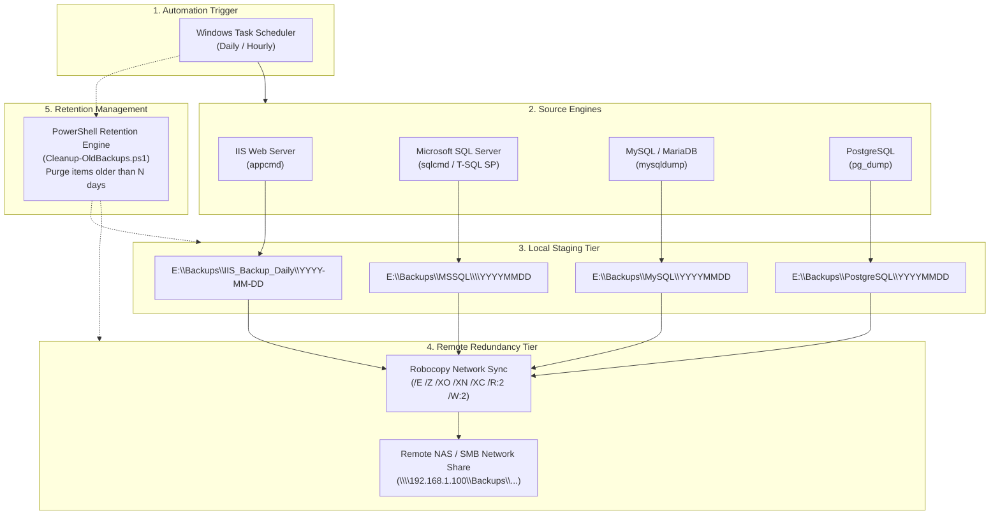

# Windows Server Backup Suite

[](LICENSE)
[]()
[]()
[]()
[]()

An enterprise-grade, automated backup and disaster-recovery solution for Windows Server environments. This suite provides automated snapshotting, local staging, resilient network synchronization (NAS/SMB share), and retention management for:

- **Internet Information Services (IIS)** web server configurations
- **Microsoft SQL Server** (2014, 2016, 2017, 2019, 2022 & Express editions)
- **MySQL / MariaDB** databases
- **PostgreSQL** databases (v12 – v17)

---

## 📑 Table of Contents

- [Architecture & Workflow](#-architecture--workflow)
- [Repository Structure](#-repository-structure)
- [Scripts Overview](#-scripts-overview)
- [Prerequisites & Requirements](#-prerequisites--requirements)
- [Configuration Guide](#-configuration-guide)
- [Task Scheduler Setup](#-task-scheduler-setup)
- [Restoration & Disaster Recovery](#-restoration--disaster-recovery)
- [Best Practices & Security](#-best-practices--security)
- [Author & Credits](#-author--credits)
- [License](#-license)

---

## 🏛 Architecture & Workflow

The backup suite follows a standardized **2-Tier Backup Architecture** (Local Staging $\rightarrow$ Remote Redundancy $\rightarrow$ Automated Retention Pruning):



---

## 📂 Repository Structure

```text
├── .gitignore                                # Git ignore rules (dumps, logs, secrets)
├── LICENSE                                   # MIT License
├── README.md                                 # Comprehensive documentation
├── config.example.bat                        # Centralized configuration template
├── IIS_Daily_Backups.bat                     # IIS configuration backup & remote copy
├── MSSQLBackup.bat                           # MSSQL backup runner for all instances
├── MSSQL_Daily_Remote_Backup.bat             # Synchronizes MSSQL backups to remote NAS
├── MySQL_Daily_Backup.bat                    # MySQL / MariaDB backup & remote copy
├── PostgreSQL_Daily_Backup.bat               # PostgreSQL backup & remote sync
├── MySQL_Daily_Remote_Backup.bat             # Backward-compatible wrapper
├── PostgressSQL_Daily_script.bat             # Backward-compatible wrapper
└── MSSQL_BackupJobs/                         # SQL Server jobs and utilities
    ├── Cleanup-OldBackups.ps1                # Reusable PowerShell retention policy engine
    ├── DBCopy_17_NAS.bat                     # SQL 2017 NAS copy script
    ├── DBCopy_19_NAS.bat                     # SQL 2019 NAS copy script
    ├── DBCopy_22_NAS.bat                     # SQL 2022 NAS copy script
    ├── MSSQLBackup.bat                       # Local instance backup runner
    ├── SQL2017.sql                           # SQL 2017 backup execution script
    ├── SQL2019.sql                           # SQL 2019 backup execution script
    ├── SQL2022.sql                           # SQL 2022 backup execution script
    ├── SQL2017-DBBackupDelete.ps1            # Retention caller for SQL 2017
    ├── SQL2019-DBBackupDelete.ps1            # Retention caller for SQL 2019
    ├── SQL2022-DBBackupDelete.ps1            # Retention caller for SQL 2022
    └── Files/                                # Stored procedures and templates
        ├── Enable_xp_cmdshell.sql            # Script to enable xp_cmdshell if required
        ├── MSSQL_BackupAll.sql               # Helper query to run full backup
        ├── Restore_Multiple_Databases.sql.example # Production DB restore template
        ├── SP.sql                            # Full/Diff/Log backup stored procedure
        ├── Verify_Stored_Procedures.sql      # Procedure verification queries
        ├── View_Stored_Procedure.sql         # View installed procedure source
        ├── WorkingSP.sql                     # Dynamic database backup stored procedure
        └── DeleteDBBackupsAfter4Days.ps1     # Legacy retention caller
```

---

## 🚀 Scripts Overview

| Script | Engine / Target | Key Operations |
|---|---|---|
| [`IIS_Daily_Backups.bat`](file:///d:/WWW/Windows-Backups-script/IIS_Daily_Backups.bat) | IIS 7.0 - 10.0 | Creates `appcmd` configuration snapshot, copies locally, pushes to remote share. |
| [`MSSQLBackup.bat`](file:///d:/WWW/Windows-Backups-script/MSSQLBackup.bat) | MS SQL Server | Iterates through configured instances (`SQL2017`, `SQL2019`, `SQL2022`) and runs backup procedures. |
| [`MSSQL_Daily_Remote_Backup.bat`](file:///d:/WWW/Windows-Backups-script/MSSQL_Daily_Remote_Backup.bat) | MS SQL Server | Synchronizes today's local MSSQL backup folder to remote storage using Robocopy. |
| [`MySQL_Daily_Backup.bat`](file:///d:/WWW/Windows-Backups-script/MySQL_Daily_Backup.bat) | MySQL / MariaDB | Executes `mysqldump` with transactional flags, stages locally, and pushes to remote share. |
| [`PostgreSQL_Daily_Backup.bat`](file:///d:/WWW/Windows-Backups-script/PostgreSQL_Daily_Backup.bat) | PostgreSQL | Dumps selected databases in compressed custom format (`-F c`), syncs to remote share. |
| [`Cleanup-OldBackups.ps1`](file:///d:/WWW/Windows-Backups-script/MSSQL_BackupJobs/Cleanup-OldBackups.ps1) | All Files / Retention | Automated retention policy script that purges backup files older than $N$ days (with `-WhatIf` simulation). |

---

## 📋 Prerequisites & Requirements

1. **Operating System**: Windows Server 2012 R2 / 2016 / 2019 / 2022 or Windows 10 / 11 Pro.
2. **Administrative Privileges**: Elevated command prompt or Windows service account with backup operator permissions.
3. **Engine Binaries**:
   - IIS: `%windir%\system32\inetsrv\appcmd.exe`
   - SQL Server: `sqlcmd.exe` (part of SQL Server Management Tools or Command Line Utilities)
   - MySQL: `mysqldump.exe` (MySQL Server or Client tools)
   - PostgreSQL: `pg_dump.exe` (PostgreSQL client tools)
4. **Network Access**: Read/Write permission on the target NAS or SMB network share (e.g., `\\192.168.1.100\Backups`).
5. **Disk Space**: Dedicated local drive for staging (e.g., `E:\Backups`).

---

## ⚙ Configuration Guide

### Option 1: Centralized Configuration (Recommended)

Copy `config.example.bat` to `config.local.bat` in the root folder:

```cmd
copy config.example.bat config.local.bat
```

Open `config.local.bat` and edit your environment paths:

```bat
:: Storage Paths
set "LOCAL_BACKUP_ROOT=E:\Backups"
set "REMOTE_BACKUP_ROOT=\\192.168.1.100\Backups"

:: Retention Period
set "RETENTION_DAYS=7"

:: PostgreSQL Settings
set "PG_BIN=C:\Program Files\PostgreSQL\16\bin"
set "PG_HOST=127.0.0.1"
set "PG_PORT=5432"
set "PG_USER=postgres"
set "PG_DATABASES=app_db analytics_db auth_db postgres"

:: MySQL Settings
set "MYSQL_BIN=C:\Program Files\MySQL\MySQL Server 8.0\bin"
set "MYSQL_HOST=127.0.0.1"
set "MYSQL_PORT=3306"
set "MYSQL_USER=backup_user"
set "MYSQL_DATABASES=app_db ecommerce_db reporting_db"
```

> [!NOTE]
> `config.local.bat` is automatically ignored by `.gitignore` so your private servers, credentials, and paths remain secure and never get committed.

### Option 2: Script-Level Configuration

Each script contains self-contained fallback variables at the top of the file if `config.local.bat` is not present.

---

## ⏰ Task Scheduler Setup

### Setting Up via Command Line (`schtasks`)

You can schedule automated daily tasks directly using elevated Command Prompt:

```cmd
:: 1. IIS Backup - Runs daily at 01:00 AM
schtasks /create /tn "Backups\IIS_Daily" /tr "E:\Windows-Backups-script\IIS_Daily_Backups.bat" /sc daily /st 01:00 /ru "SYSTEM" /rl HIGHEST

:: 2. MSSQL Backup - Runs daily at 02:00 AM
schtasks /create /tn "Backups\MSSQL_Daily" /tr "E:\Windows-Backups-script\MSSQLBackup.bat" /sc daily /st 02:00 /ru "SYSTEM" /rl HIGHEST

:: 3. MSSQL Remote Sync - Runs daily at 03:00 AM
schtasks /create /tn "Backups\MSSQL_RemoteSync" /tr "E:\Windows-Backups-script\MSSQL_Daily_Remote_Backup.bat" /sc daily /st 03:00 /ru "SYSTEM" /rl HIGHEST

:: 4. MySQL Backup - Runs daily at 02:30 AM
schtasks /create /tn "Backups\MySQL_Daily" /tr "E:\Windows-Backups-script\MySQL_Daily_Backup.bat" /sc daily /st 02:30 /ru "SYSTEM" /rl HIGHEST

:: 5. PostgreSQL Backup - Runs daily at 03:30 AM
schtasks /create /tn "Backups\PostgreSQL_Daily" /tr "E:\Windows-Backups-script\PostgreSQL_Daily_Backup.bat" /sc daily /st 03:30 /ru "SYSTEM" /rl HIGHEST

:: 6. Retention Prune - Runs every Sunday at 04:00 AM
schtasks /create /tn "Backups\Cleanup_OldBackups" /tr "powershell -NoProfile -ExecutionPolicy Bypass -File E:\Windows-Backups-script\MSSQL_BackupJobs\Cleanup-OldBackups.ps1 -Path 'E:\Backups' -RetentionDays 7" /sc weekly /d SUN /st 04:00 /ru "SYSTEM" /rl HIGHEST
```

### Setting Up via Task Scheduler GUI

1. Open **Task Scheduler** (`taskschd.msc`).
2. Click **Create Task** (not Basic Task) in the Actions pane.
3. On the **General** tab:
   - Check **Run whether user is logged on or not**.
   - Check **Run with highest privileges**.
4. On the **Triggers** tab: Click **New** $\rightarrow$ Set to **Daily** $\rightarrow$ Set desired time.
5. On the **Actions** tab: Click **New** $\rightarrow$ **Action: Start a program**:
   - Program/script: `E:\Windows-Backups-script\IIS_Daily_Backups.bat` (or desired script).
   - Start in: `E:\Windows-Backups-script\`
6. Click **OK** and enter service account credentials when prompted.

---

## 🔄 Restoration & Disaster Recovery

### 1. Restoring IIS Configuration
To restore an IIS snapshot created by `appcmd`:

```cmd
:: List available backups
%windir%\system32\inetsrv\appcmd list backup

:: Restore specific backup
%windir%\system32\inetsrv\appcmd restore backup "DailyBackup_2026-09-08"
```

### 2. Restoring Microsoft SQL Server Databases
Use the provided template: [`Restore_Multiple_Databases.sql.example`](file:///d:/WWW/Windows-Backups-script/MSSQL_BackupJobs/Files/Restore_Multiple_Databases.sql.example).

```sql
RESTORE DATABASE [AppDB] 
FROM DISK = N'E:\Backups\MSSQL\SQL2022\20260908\AppDB_20260908.BAK' 
WITH FILE = 1,
     MOVE N'AppDB_Data' TO N'C:\Program Files\Microsoft SQL Server\MSSQL16.MSSQLSERVER\MSSQL\DATA\AppDB.mdf',
     MOVE N'AppDB_Log'  TO N'C:\Program Files\Microsoft SQL Server\MSSQL16.MSSQLSERVER\MSSQL\DATA\AppDB_log.ldf',
     REPLACE, STATS = 5;
```

### 3. Restoring MySQL / MariaDB Databases
```cmd
mysql -h 127.0.0.1 -u backup_user -p app_db < E:\Backups\MySQL\20260908\app_db_20260908.sql
```

### 4. Restoring PostgreSQL Databases
```cmd
pg_restore -h 127.0.0.1 -p 5432 -U postgres -d app_db -v -c "E:\Backups\PostgreSQL\20260908\app_db_20260908.backup"
```

---

## 🔒 Best Practices & Security

- **Principle of Least Privilege**: Run tasks under a dedicated service account (e.g. `svc_backup`) granted only read access to databases and write access to backup targets.
- **Network Share Isolation**: Restrict write access on the remote NAS share strictly to the backup service account and DBA group.
- **Password Security**: Avoid storing plaintext database passwords in `.bat` files.
  - PostgreSQL: Use `%APPDATA%\postgresql\pgpass.conf`.
  - MySQL: Use `mysql_config_editor set --login-path=backup --user=backup_user --password`.
  - MSSQL: Use Windows Integrated Authentication (`-E` flag in `sqlcmd`).
- **Test Restores Regularly**: A backup is only as good as its tested restore. Schedule automated or quarterly test restores.

---

## 👤 Author & Credits

- **Author**: [Mangesh Mundhava](https://github.com/mangesh4694)
- **Repository**: [Windows-Backups-script](https://github.com/mangesh4694/Windows-Backups-script)

---

## 📄 License

This project is licensed under the **MIT License** - see the [LICENSE](LICENSE) file for details.
Free for commercial and personal use.
